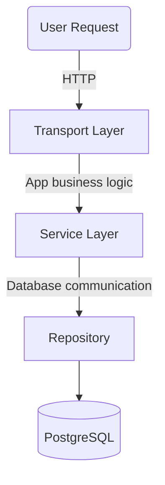

## Backend

### Prerequisite

- Update the value of the environment variables in `docker-compose.yaml`.
- Copy the file `env.sample` to a new file `.env`. Update the configuration to your need.


### Development

- Running the PostgreSQL container: `make db-up`
- Build the Go binary and run: `make run`

### How To Test

- Ping: `GET api/v1/auth/ping`

    ```json
    {
        "code": 200,
        "message": "User route is reachable",
        "data": null
    }
    ```

### Project Structure


